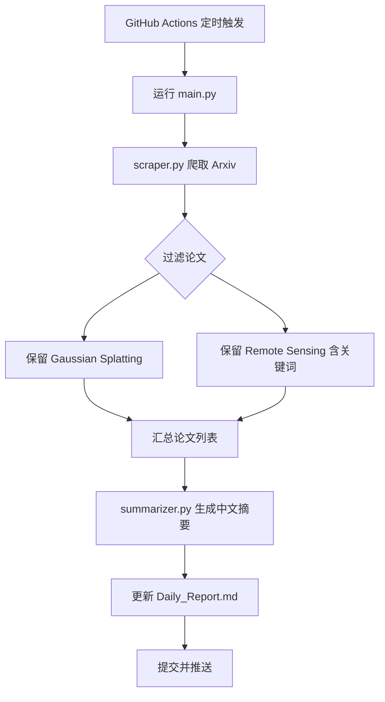

# Arxiv-Daily-3DGS 项目设计

## 系统架构



## 文件结构

```
.
├── config.py               # 配置参数
├── scraper.py              # Arxiv 爬虫与过滤
├── summarizer.py           # 硅基流动 API 摘要生成
├── main.py                 # 主流程脚本
├── Daily_Report.md         # 生成的日报
├── requirements.txt        # Python 依赖
├── README.md               # 项目说明
├── .github/workflows/daily.yml # GitHub Actions 工作流
└── .gitignore              # 忽略文件
```

## 模块详细设计

### config.py
- `BASE_URL`: 硅基流动 API 地址
- `MODEL_ID`: 模型标识
- `API_KEY`: 从环境变量读取
- `KEYWORDS`: 搜索关键词列表
- `FILTER_DAYS`: 最近天数
- `REMOTE_SENSING_KEYWORDS`: 用于过滤的 AI 相关关键词

### scraper.py
- 函数 `fetch_papers(keyword, days=1)` 使用 `arxiv` 库搜索
- 函数 `filter_remote_sensing(papers)` 根据标题/摘要包含关键词进行过滤
- 返回结构化的论文列表（标题、作者、摘要、链接、日期）

### summarizer.py
- 函数 `summarize_abstract(abstract)` 调用硅基流动 API
- 使用 OpenAI 兼容接口，设置 `base_url` 和 `api_key`
- 系统提示词固定为中文总结格式
- 错误处理：捕获异常并返回 None

### main.py
1. 导入配置和模块
2. 对每个关键词爬取论文
3. 合并并去重
4. 对每篇论文生成摘要
5. 读取现有的 `Daily_Report.md`，将新条目插入顶部（按日期倒序）
6. 写入文件

### Daily_Report.md 格式
```
# 每日论文报告 (YYYY-MM-DD)

## Gaussian Splatting

### [论文标题](链接)
- **作者**: 作者列表
- **日期**: YYYY-MM-DD
- **摘要**: 原文摘要
- **中文总结**:
  - **创新点**: ...
  - **方法**: ...
  - **结论**: ...

## Remote Sensing

...
```

## 待澄清问题
1. Daily_Report.md 新条目插入位置（顶部 vs 底部）？
2. 硅基流动 API 是否完全兼容 OpenAI SDK？
3. 是否需要 `python-dotenv`？

## 下一步
根据用户反馈调整设计，然后开始实现。